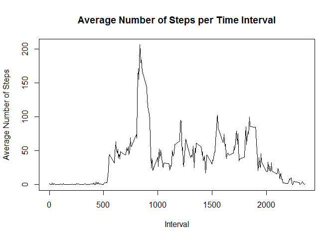
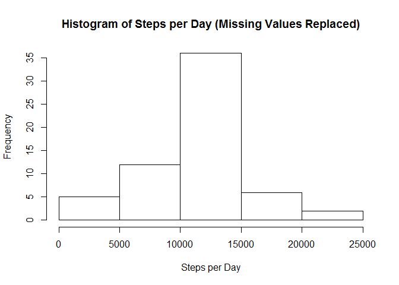
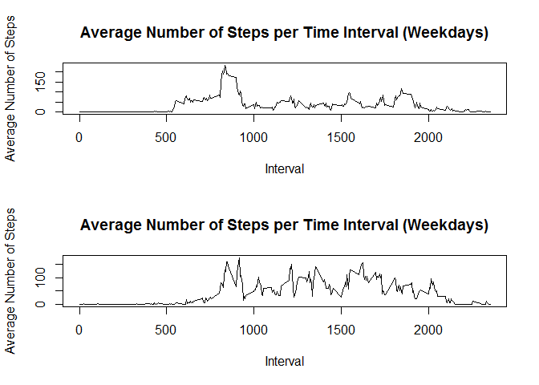

# Reproducible Research: Peer Assessment 1


## Loading and preprocessing the data
To load the data I chose to read the .csv file into a dataframe with read.csv.  Then I transformed that dataframe into a datatable with the transform() function.

```r
library(data.table)
rawData = read.csv(file="activity.csv");
table = data.table(rawData);
table = transform(table, steps = as.numeric(steps));
```

## What is mean total number of steps taken per day?

```r
sumStepsDay = table[,list(sum=sum(steps, na.rm=TRUE)),by=date];
meanStepsDay = mean(sumStepsDay[,sum], na.rm=TRUE);
medianStepsDay = median(sumStepsDay[,sum], na.rm=TRUE);
hist(x=sumStepsDay$sum, main="Histogram of Steps per Day", xlab="Steps per Day");
```

 
From this simple data analysis we can see that the mean is 9354.2295082 steps per day and the median is 1.0395\times 10^{4} steps per day.

## What is the average daily activity pattern?

```r
meanStepsInterval = table[,list(mean=mean(steps, na.rm=TRUE)),by=interval];
plot(x=meanStepsInterval$interval, y=meanStepsInterval$mean, type="l",xlab="Interval",ylab="Average Number of Steps", main="Average Number of Steps per Time Interval");
```

 

```r
maxInterval = meanStepsInterval[meanStepsInterval$mean==max(meanStepsInterval$mean), interval];
```
We can see that the interval that contains the maximum average of steps across all the days is the 835'th interval.

## Imputing missing values
To resolve the issue of missing, wherever a missing data point was I added the mean value of steps for that given interval.  See below:


```r
## Popluate missingTable with mean values per interval
missingTable = data.table(table)
for (i in 1:nrow(table))
{
    if(is.na(table[i, steps]))
    {
        currInterval = table[i, interval];
        missingTable[i,1] = meanStepsInterval[meanStepsInterval$interval==currInterval,mean];
    }
}

sumMissingStepsDay = missingTable[,list(sum=sum(steps, na.rm=TRUE)),by=date];
meanMissingStepsDay = mean(sumMissingStepsDay[,sum], na.rm=TRUE);
medianMissingStepsDay = median(sumMissingStepsDay[,sum], na.rm=TRUE);
hist(x=sumMissingStepsDay$sum, main="Histogram of Steps per Day (Missing Values Replaced)", xlab="Steps per Day");
```

 
After inserting the mean value for the respective time interval of missing data we can see that the mean  is 1.0766189\times 10^{4} steps per day and the median is 1.0766189\times 10^{4} steps per day.

## Are there differences in activity patterns between weekdays and weekends?

```r
table$date = as.Date(table$date, format="%Y-%m-%d");
table$dayType = ifelse((weekdays(table$date)=="Saturday") | (weekdays(table$date)=="Sunday"), "weekend", "weekday");
table$dayType = as.factor(table$dayType);
weekends = table[table$dayType=="weekend",];
weekdays = table[table$dayType=="weekday",];
par(mfrow = c(2,1))

## Plot weekdays
meanStepsIntervalWeekdays = weekdays[,list(mean=mean(steps, na.rm=TRUE)),by=interval];
plot(x=meanStepsIntervalWeekdays$interval, y=meanStepsIntervalWeekdays$mean, type="l",xlab="Interval",ylab="Average Number of Steps", main="Average Number of Steps per Time Interval (Weekdays)");

## Plot weekends
meanStepsIntervalWeekends = weekends[,list(mean=mean(steps, na.rm=TRUE)),by=interval];
plot(x=meanStepsIntervalWeekends$interval, y=meanStepsIntervalWeekends$mean, type="l",xlab="Interval",ylab="Average Number of Steps", main="Average Number of Steps per Time Interval (Weekdays)");
```

 
